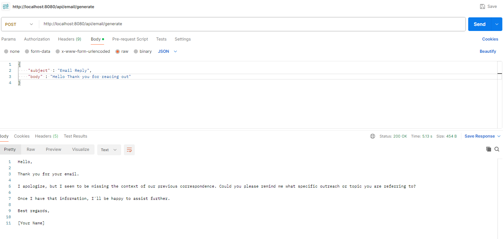

# SpringAI - Spring Framework and Gemini AI API Integration

https://ai.google.dev/gemini-api/docs#rest

Go to https://start.spring.io/ to generate a SpringBoot project for Gemini AI API integration

Include  Spring Web and Gemini AI dependencies while creating spring Boot Application

Create API Key required to integrate with Gemini API

Configure that in application properties

gemini.api.url=${GEMINI_URL}
gemini.api.key=${GEMINI_KEY}

Write a Controller class and add Post Api method to call Gemini API to get Email Response.

Build and run the SpringBoot application to make it up and running on default port 8080.

mvn clean install

mvn spring-boot:run

Once the application is up and running, hit the below url using Postman Get Api call or directly in Browser to see the final output

http://localhost:8080/api/email/generate

Request Body : 
{
    "subject" : "Email Reply",
    "body" : "Hello Thank you for reacing out"
}

Output : 

