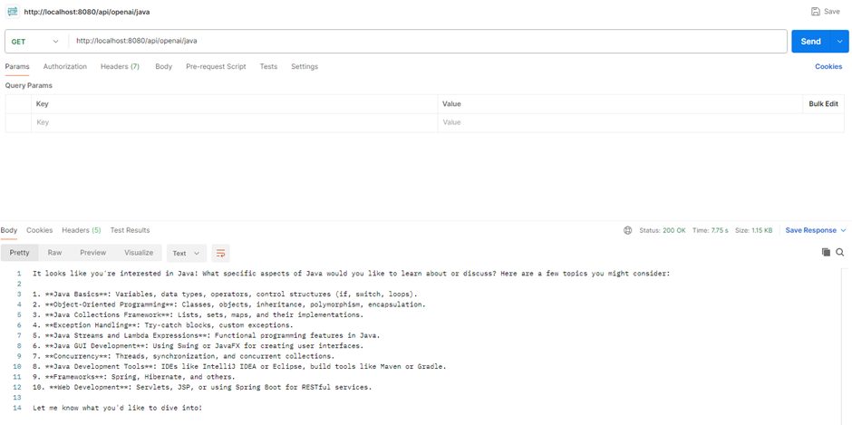
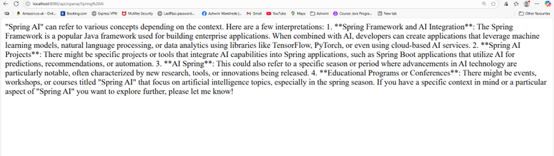

# SpringAI - Spring Framework and AI Integration

# Open AI Chat Model Integration

**https://docs.spring.io/spring-ai/reference/api/chat/openai-chat.html**

Go to **https://start.spring.io/** to generate a SpringBoot project for OpenAI integration

Include  Spring Web and OpenAI AI dependencies while creating spring Boot Application

OpenAI AI - Spring AI support for ChatGPT, the AI language model and DALL-E, the Image generation model from OpenAI.

Create your account on OpenAI platform https://platform.openai.com/

Create API Key required to integrate with OpenAI Chat model through spring AI

Configure that in application properties

**spring.ai.openai.api-key="openai_api_key"**

Write a Controller class and add Get Api method to call ChatModel by sending a message passed in path parameter and send the response back.

Build and run the SpringBoot application to make it up and running on default port 8080.

**mvn clean install**

**mvn spring-boot:run**

Once the application is up and running, hit the below url using Postman Get Api call or directly in Browser to see the final output

**http://localhost:8080/api/openai/java**

**http://localhost:8080/api/openai/Spring%20AI**

# Google AI Gemini API Integration

https://ai.google.dev/gemini-api/docs#rest

Go to https://start.spring.io/ to generate a SpringBoot project for Gemini AI API integration

Include Spring Web and Gemini AI dependencies while creating spring Boot Application

Create API Key required to integrate with Gemini API

Configure that in application properties

gemini.api.url=${GEMINI_URL} 
gemini.api.key=${GEMINI_KEY}

Write a Controller class and add Post Api method to call Gemini API to get Email Response.

Build and run the SpringBoot application to make it up and running on default port 8080 or you can use any valid port, 

For example **server.port=8000**

**mvn clean install**

**mvn spring-boot:run**

Once the application is up and running, hit the below url using Postman Post Api call by providing the request body and valid api Key to get the success response with response code 200

**http://localhost:8080/api/email/generate**

**Request Body**
{ 
  "subject" : "Email Reply", 
  "body" : "Hello Thank you for reaching out" 
}

